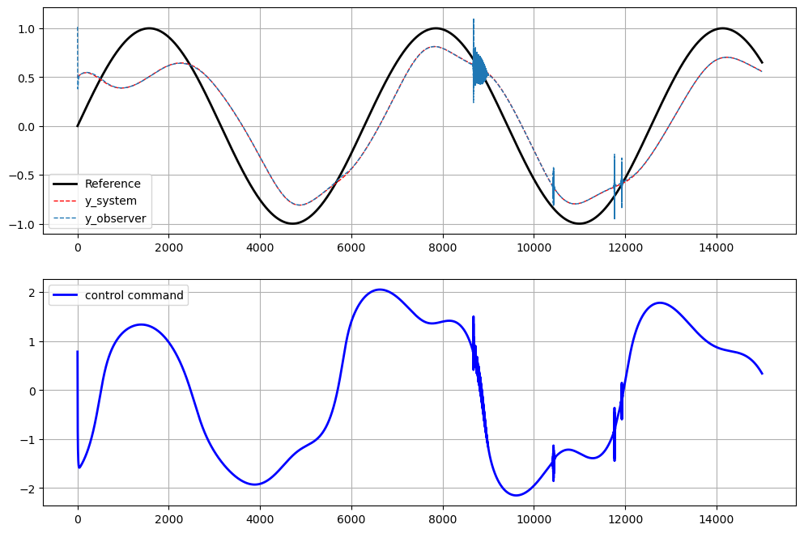
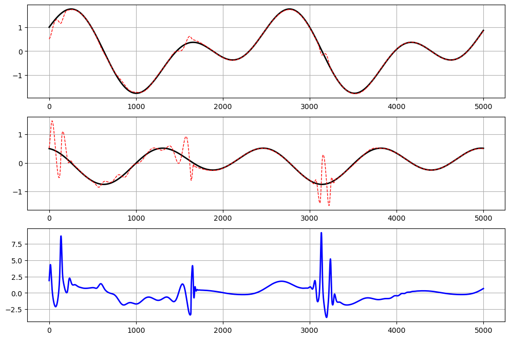
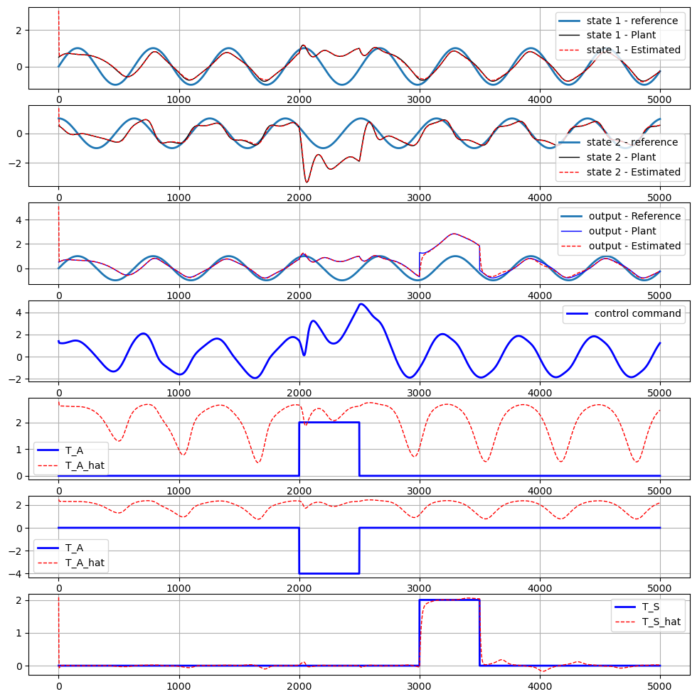
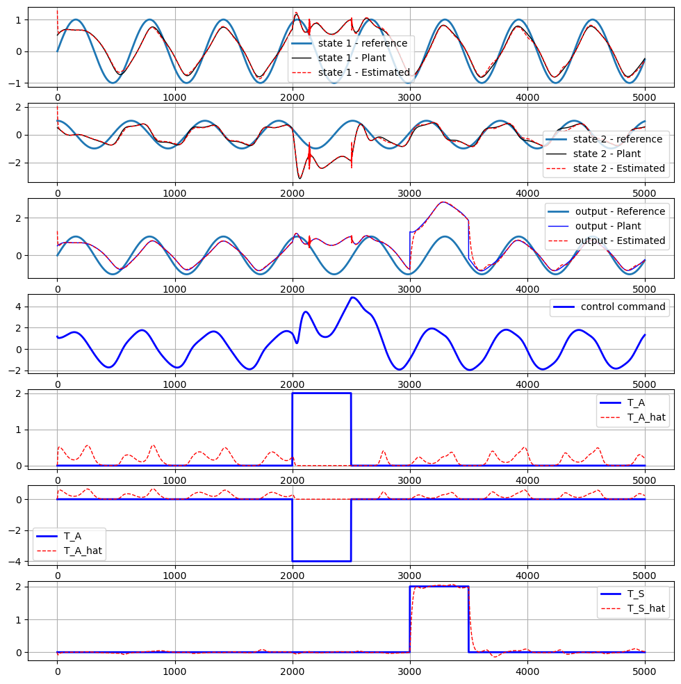

# Intelligent-Control-and-Fault-Diagnosis
This repository is designed for the graduate course "Intelligent Control and Fault Diagnosis," intended for control engineering students. It contains various code implementations to explore multiple approaches in control and fault diagnosis, leveraging the mathematical relationships inherent in these methods.

## Course Titles

| Course Title | Link |
|--------------|------|
| Model-Based Adaptive Multi-Layer Perceptron Control | [Link](https://github.com/KianoushAqabakee/Intelligent-Control-and-Fault-Diagnosis/tree/main/Control/Model-Based%20MLP) |
| Model-Based Adaptive Radial Basis Function NN Control | [Link](https://github.com/KianoushAqabakee/Intelligent-Control-and-Fault-Diagnosis/tree/main/Control/Model-Based%20RBF) |
| Identifier-Based Adaptive Multi-Layer Perceptron Control | [Link](https://github.com/KianoushAqabakee/Intelligent-Control-and-Fault-Diagnosis/tree/main/Control/Identifier-Based%20MLP) |
| Identifier-Based Adaptive Radial Basis Function NN Control | [Link](https://github.com/KianoushAqabakee/Intelligent-Control-and-Fault-Diagnosis/tree/main/Control/Identifier-Based%20RBF) |
| Identifier-Based Adaptive Radial Basis Function NN Control | [Link](https://github.com/KianoushAqabakee/Intelligent-Control-and-Fault-Diagnosis/tree/main/Control/Identifier-Based%20RBF) |

| Course Title | Link |
|--------------|------|
| Model-Based Fault Detection with Adaptive Multi-Layer Perceptron | [Link](https://github.com/KianoushAqabakee/Intelligent-Control-and-Fault-Diagnosis/tree/main/Fault/Model-Based%20MLP) |
| Model-Based Fault Detection with Adaptive Radial Basis Function NN | [Link](https://github.com/KianoushAqabakee/Intelligent-Control-and-Fault-Diagnosis/tree/main/Fault/Model-Based%20RBF) |
| Data-Based Fault Detection with Radial Basis Function NN | [Link](https://github.com/KianoushAqabakee/Intelligent-Control-and-Fault-Diagnosis/tree/main/Fault/Data-Based%20RBF) |
| Fault Detection with Reinforcement Learning and Transfer Learning | [Link](https://github.com/KianoushAqabakee/Intelligent-Control-and-Fault-Diagnosis/tree/main/Fault/Reinforcement%20Learning) |

## Model-Based Adaptive Multi-Layer Perceptron Control

## Identifier-Based Adaptive Multi-Layer Perceptron Control

## Model-Based Adaptive Radial Basis Function Neural Network Control

## Model-Based Adaptive Multi-Layer Perceptron Fault Detection

## Model-Based Adaptive Radial Basis Function Neural Network Fault Detection

