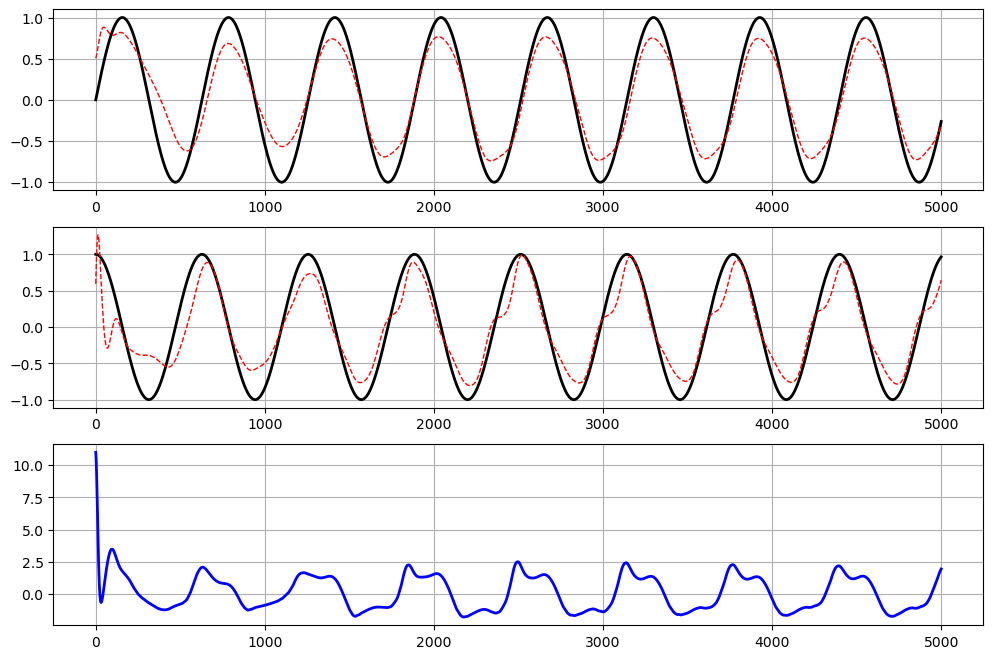

# Intelligent-Control-and-Fault-Diagnosis

## Model-Based Adaptive Multi-Layer Perceptron Control

## Identifier-Based Adaptive Multi-Layer Perceptron Control

## Model-Based Adaptive Radial Basis Function Neural Network Controll

## Model-Based Adaptive Multi-Layer Perceptron Fault Detection

## Model-Based Adaptive Radial Basis Function Neural Network Fault Detection

